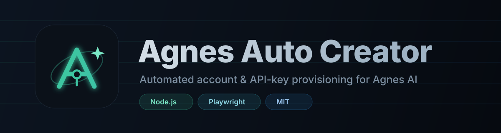

<div align="center">



<br>

**Agnes AI のアカウントと API キーを全自動で発行 — 新規メール、ランダムな認証情報、エンドツーエンド。**

<br>

[](https://nodejs.org)
[](https://playwright.dev)
[](../LICENSE)
[](../CHANGELOG.md)
[](#動作要件)
[](../CONTRIBUTING.md)

<br>

[English](../README.md) · [Bahasa Indonesia](README.id.md) · [日本語](README.ja.md) · [简体中文](README.zh-CN.md) · [Español](README.es.md)

</div>

---

## ✨ 機能

**Agnes Auto Creator** は [Agnes AI](https://platform.agnes-ai.com) のアカウントを
完全自動で発行します。アカウントごとに次の処理を行います：

1. 🎲 ランダムな識別情報を生成 — メールのローカル部、強力なパスワード、氏名。
2. 📧 新しい [zenvex.dev](https://zenvex.dev) の一時受信箱を使用。
3. 🔐 Agnes のメール認証コードを要求して読み取る。
4. ✅ アカウントを登録。
5. 🔑 ログインして、ランダムな名前の **API キー** を作成。

すべてスクリプト化されており、Ubuntu VPS ですぐに実行できます。

> **アカウントごとの成果物:** `sk-...` の API キーと認証情報。ローカルの JSON
> ファイルに保存されます。

## 🚀 クイックスタート

```bash
git clone https://github.com/0xgetz/agnes-auto-creator.git
cd agnes-auto-creator
chmod +x setup.sh
./setup.sh                 # 依存関係を導入し、1 アカウント作成
```

手動の場合：

```bash
npm install
npx playwright install --with-deps chromium
node src/index.mjs -n 3 -o accounts.json
```

## 🖥️ 動作要件

| 項目      | 最小                           |
| --------- | ------------------------------ |
| Node.js   | 18+                            |
| OS        | Linux (Ubuntu/Debian), macOS   |
| ディスク  | 約 400 MB (Chromium)           |
| ネットワーク | Agnes と zenvex への送信 HTTPS |

> **なぜ Playwright？** Agnes の API 自体はブラウザ不要の純粋な HTTPS です。
> ブラウザが必要なのは **zenvex.dev** の受信箱だけです。ここは Cloudflare の
> アンチボットで保護されており、素の HTTP クライアントを拒否するため、実際の
> Chromium で読む必要があります。詳しくは
> [docs/ARCHITECTURE.md](../docs/ARCHITECTURE.md) を参照。

## 🛠️ 使い方

```bash
node src/index.mjs [オプション]
```

| オプション           | 既定値                            | 説明                     |
| -------------------- | --------------------------------- | ------------------------ |
| `-n, --count N`      | `1`                               | 作成するアカウント数     |
| `-d, --domain D`     | 一覧からランダム                  | zenvex の受信ドメイン    |
| `-o, --out FILE`     | `agnes-accounts-<timestamp>.json` | 出力ファイル             |
| `-t, --timeout MS`   | `120000`                          | 認証メールの最大待機時間 |
| `--concurrency N`    | `1`                               | 並列で作成する数         |
| `--headful`          | オフ                              | ブラウザを表示（デバッグ）|
| `-q, --quiet`        | オフ                              | 最終サマリーのみ表示     |
| `-h, --help`         | —                                 | ヘルプを表示             |

### 例

```bash
# 1 アカウント作成
node src/index.mjs

# 特定ドメインで 5 アカウント作成
node src/index.mjs -n 5 -d znvx.me -o accounts.json

# 3 アカウントを 2 並列で作成
node src/index.mjs -n 3 --concurrency 2
```

### ライブラリとして使う

```js
import { chromium } from "playwright";
import { provisionOne } from "./src/core/provision.mjs";

const browser = await chromium.launch();
const context = await browser.newContext();
const account = await provisionOne(context, { domain: "souss.dev" });

console.log(account.api_key);
await browser.close();
```

詳細は [`examples/programmatic.mjs`](../examples/programmatic.mjs)。

## 📦 出力形式

```json
[
  {
    "ok": true,
    "email": "swiftfox482913@souss.dev",
    "password": "Xk7!mQ2vPz9rLt4w",
    "full_name": "Putri Maharani",
    "email_provider": "zenvex.dev (souss.dev)",
    "api_key_name": "prod-token-7421",
    "api_key": "sk-................................",
    "user_id": 995419,
    "user_display_id": "20260927133451462",
    "elapsed_ms": 21430,
    "created_at": "2026-09-30T13:36:01.000Z"
  }
]
```

ファイルは**アカウントごとに書き込まれる**ため、途中で停止しても完了済みの
結果は失われません。

## 🗂️ プロジェクト構成

```
src/
  index.mjs            CLI · 引数解析 · ワーカープール
  core/provision.mjs   1 アカウントのエンドツーエンド処理
  agnes/client.mjs     Agnes REST API クライアント
  inbox/zenvex.mjs     zenvex.dev 受信箱リーダー (Playwright)
  utils/random.mjs     ランダム識別情報ジェネレーター
  utils/logger.mjs     色付き構造化ロガー
docs/
  ARCHITECTURE.md      仕組みとエンドポイント一覧
  readme/              翻訳 (en, id, zh-CN, es)
  assets/              ロゴ · バナー · ワードマーク
examples/              ライブラリ使用例
```

## ⚠️ 注意点

- **ドメインごとのレート制限。** 一部の一時メールドメインで Agnes が
  *"Too many registration attempts from this email domain"* を返すことがあります。
  その場合は別の `--domain`（例: `znvx.me`）で再試行してください。
- **コードはすぐ失効します。** スクリプトは即座に読み取って送信するため、
  `--timeout` を数分以上に増やしても意味はありません。
- **VPS でのヘッドレス Chromium** には `--no-sandbox`（設定済み）と、
  `npx playwright install --with-deps chromium` による OS ライブラリが必要です。
- **生成される機密情報。** 出力ファイルは `.gitignore` 済みです。コミットしないでください。

## 🧭 設計方針

このプロジェクトは**意図的に CI なし**です — GitHub Actions もランナーも、
クラウド上のシークレットもありません。自分のマシンでローカルに実行します。
可動部が少なく、漏れるものがありません。

## 🤝 コントリビュート

貢献を歓迎します！まず [CONTRIBUTING.md](../CONTRIBUTING.md) と
[SECURITY.md](../SECURITY.md) をお読みください。

## 📄 ライセンス

[MIT ライセンス](../LICENSE) © 0xgetz の下で公開されています。

<div align="center">
<br>
<sub>Agnes AI および SapiensAI とは無関係です。利用規約に従い、責任をもって使用してください。</sub>
</div>
